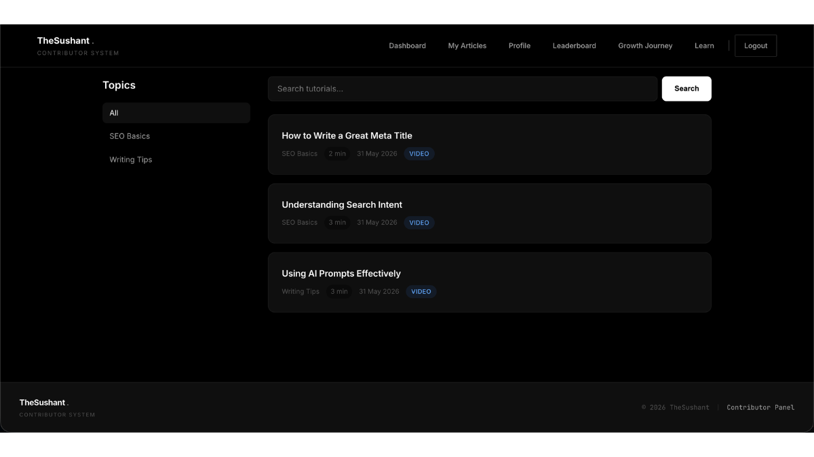
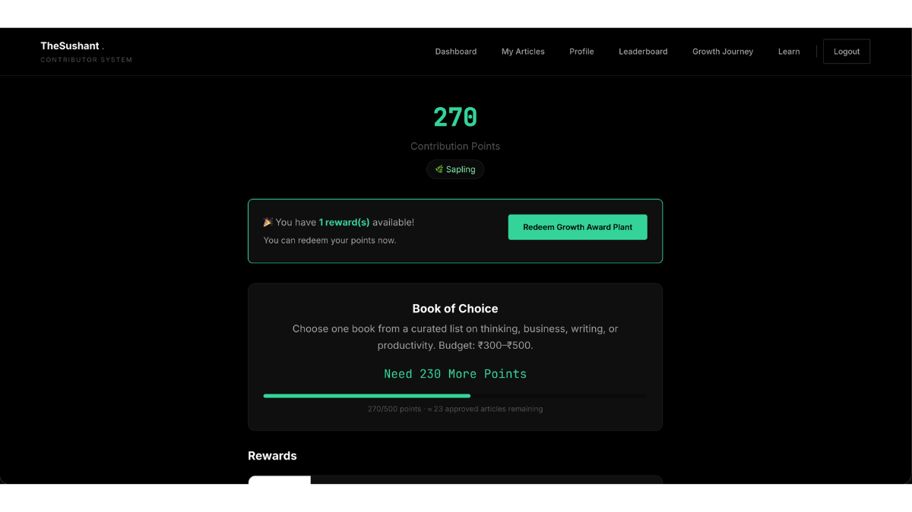
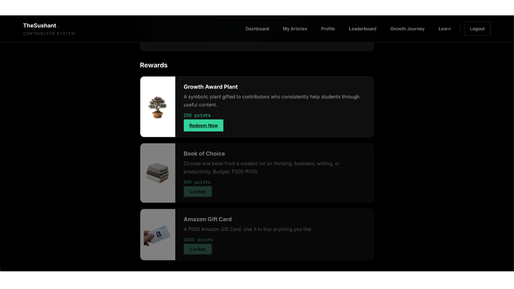
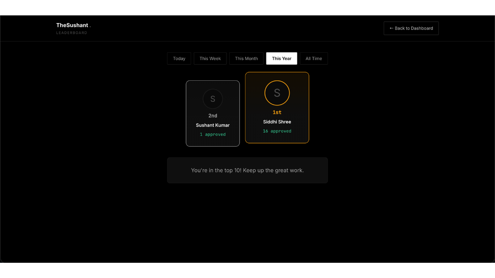

# Contributor Management Platform

A production-ready contributor platform built to streamline content creation, editorial review, and learning workflows.

---

## Overview

The Contributor Management Platform is a centralized system designed for writers, editors, and administrators. It combines authentication, content creation, learning resources, rewards, and leaderboards into a unified experience.

---

## Core Features

### Authentication

* Secure login
* Session management
* Role-based access control

### Writer Dashboard

* Personalized dashboard
* Progress tracking
* Assigned tasks
* Activity overview

### Content Editor

* Rich text editor
* Auto-save
* Draft management
* Publishing workflow

### Learning Center

* Learning dashboard
* Course/content pages
* Structured learning experience

### Rewards & Gamification

* Rewards section
* Progress tracking
* Leaderboard
* Contributor engagement

---

## Technology Stack

* PHP
* MySQL
* HTML
* CSS
* JavaScript

---

## Screenshots

### Login

### Dashboard

### Article Editor

### Article Editor (Extended View)

### Learning Home

### Learning Page

### Rewards

### Rewards (Detailed View)

### Leaderboard

---

## Status

Production-ready platform built for real-world content operations and contributor management.

---

## Author

Sushant Kumar

Portfolio:
https://thesushant.in/portfolio

Website:
https://thesushant.in
